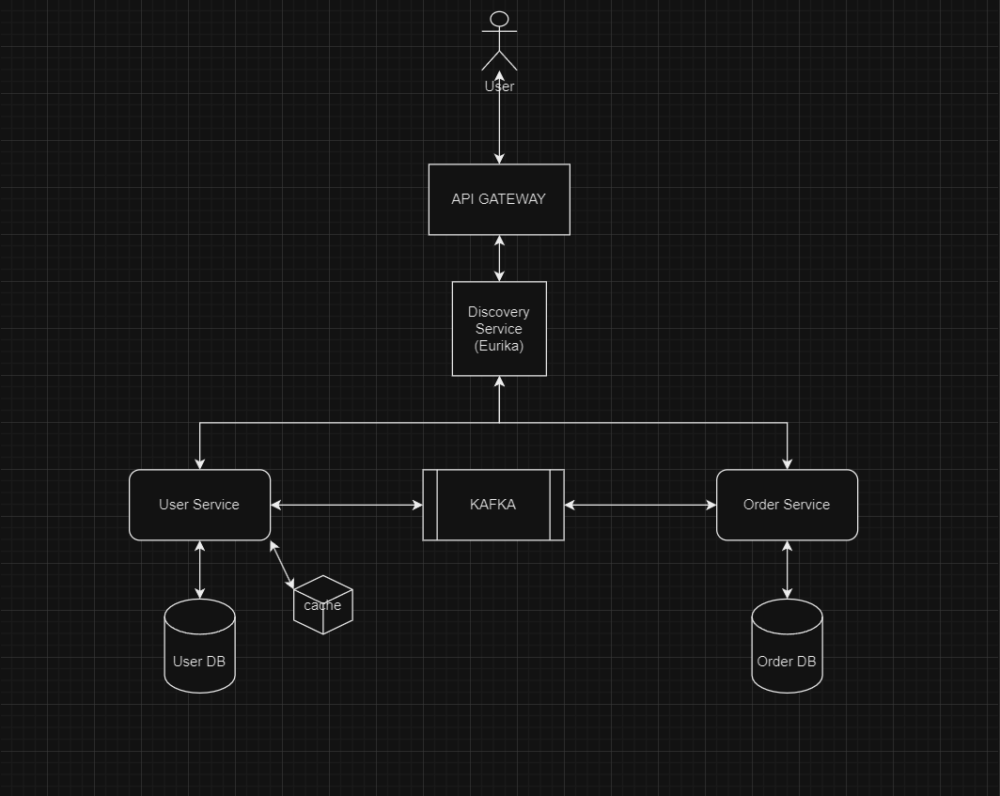

# Project Overview

Order management project consists of two microservices (`user-service` and `order-service`), along with two additional projects: `api-gateway` and `naming-server`. The services are built using Spring Boot and communicate via Kafka. PostgreSQL with Flyway is used for database management, and Spring Cloud facilitates service discovery and configuration management.



## Technology Stack

- **Java**: Version 21
- **Spring Boot**: Latest version
- **Spring Cloud**: Latest version
- **Database**: PostgreSQL with Flyway for schema management
- **Messaging**: Kafka for communication between microservices

# Building and Running the Project

To build and run the project using Docker Compose, follow the instructions below.

## Prerequisites

- Docker Compose installed and configured on your system.

## Steps

1. **Build Docker images for project**

   Execute the following command to build the Docker images defined in your `docker-compose.yml`:

   ```sh
   windows: .\build-all.bat
   unix:    ./build-all.sh
   ```
2. **Start entire application in docker**
   ```sh
   docker-compose up -d
   ```
3. **Start postgres and kafka inside docker(when running project from IDE)**
   ```sh
   docker-compose up -d user-db order-db zookeeper kafka
   ```
## Using the system
- **API Gateway**:
    - Accessible at `http://localhost:8765`
    - Swagger Documentation: Accessible at `http://localhost:8765/webjars/swagger-ui/index.html`

- **Eureka Naming Server**:
    - Accessible at `http://localhost:8761`
- **Authentication**:
    - `/api/v1/auth/register` endpoint can be used for creating a new user which later can authenticate using `/api/v1/auth/register` endpoint. returned token can be used for making call to other API endpoints.